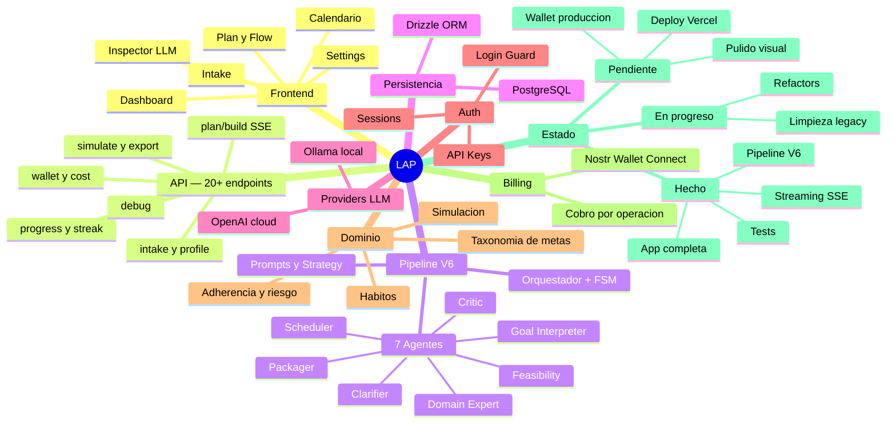

# Mapa Mental — LAP (Life Action Planner)

> Abrir en Obsidian en **Reading View** (`Ctrl+E`) para ver el diagrama.

---

## Como leer este mapa

| Rama | Que es |
|------|--------|
| **Frontend** | 5 paginas Next.js 15 con App Router |
| **API** | 20+ endpoints REST, varios con streaming SSE |
| **Pipeline V6** | Corazon del producto: orquestador con 7 agentes IA especializados |
| **Persistencia** | PostgreSQL con Drizzle ORM |
| **Providers** | OpenAI para produccion, Ollama para desarrollo local |
| **Auth** | Sesiones, API keys, login guard |
| **Dominio** | Logica de negocio: metas, simulacion, adherencia, riesgo |
| **Billing** | Pagos Lightning via Nostr Wallet Connect |
| **Estado** | Resumen de que esta hecho, en progreso y pendiente |
